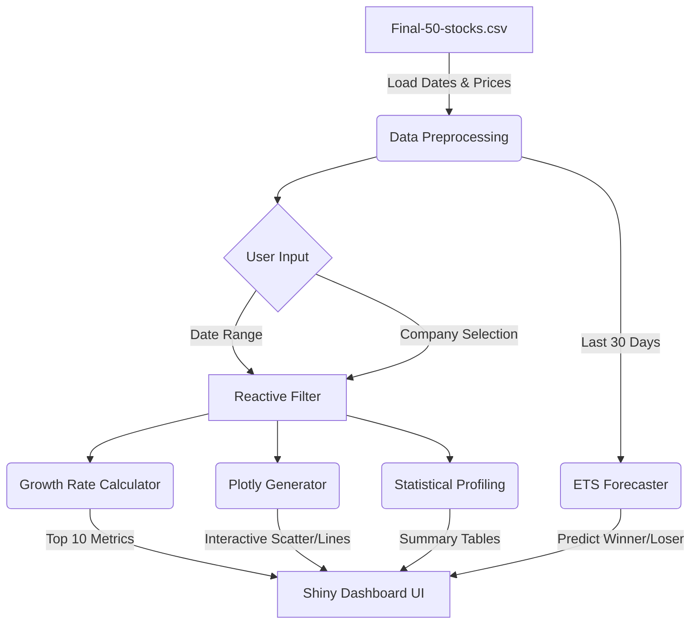

<div align="center">

# 📈 Stock Market Analytics & Prediction Dashboard

**An interactive R Shiny application for visualizing historical trends, comparing sector growth, and forecasting future prices for 50 diverse stocks.**

[](https://www.r-project.org/)
[](https://shiny.posit.co/)
[](https://plotly.com/r/)
[](https://pkg.robjhyndman.com/forecast/)

</div>

---

This project provides a comprehensive, data-driven approach to understanding the stock market. Built entirely in R, it features a highly interactive dashboard that allows users to seamlessly navigate through historical performance, calculate precise growth rates, and leverage exponential smoothing (ETS) models to forecast short-term market movements.

| Capability | Detail |
|---------|--------|
| 📊 **Interactive Charts** | Hover, zoom, and pan across historical price lines using Plotly |
| 🚀 **Dynamic Growth Rates** | Calculate exact percentage growth strictly within your selected date ranges |
| 🔮 **ETS Forecasting** | 30-day predictive modeling utilizing standard R `forecast` time-series smoothing |
| 🏭 **Sector Profiling** | Grouped analytics covering Tech, Banking, Auto, Pharma, Petroleum, and more |
| 📥 **Data Export** | Download custom-filtered CSVs and statistical text summaries on the fly |

---

## ✨ Core Features
- 🌐 **Reactive Interactivity** — All charts and metrics dynamically respond to user-defined `dateRange` constraints.
- 🏗️ **DRY Architecture** — Modularized rendering logic ensures lightweight, maintainable code avoiding massive duplication.
- 📈 **Sector Overlays** — Easily contrast the performance of competing companies inside the same industry.
- 🧠 **Algorithmic Predictions** — Identifies probable short-term "Winners" and "Losers" based on recent momentum.
- 📉 **Statistical Breakdown** — Instant access to Mean, Median, Variance, and Standard Deviation per stock.

---

## 🛠️ Tech Stack
| Category | Technologies |
|----------|-------------|
| **Language** | R |
| **Dashboard** | `shiny`, `shinydashboard`, `shinyWidgets` |
| **Data Manipulation** | `dplyr`, `tidyr` |
| **Visualization** | `ggplot2`, `plotly` |
| **Time Series / ML** | `forecast` (ETS Modeling) |

---

## 🏗️ Execution Pipeline


---

## 📁 Project Structure
```text
Stock-Market-Analysis/
├── README.md                           # Documentation
└── RPackageFinal/
    └── RPackageFinal/
        ├── package_R2.R                # 🚀 Main Shiny App (UI + Server)
        ├── Final-50-stocks.csv         # 📊 Primary historical dataset
        ├── GrowthRate.csv              # Initial metrics snapshot
        └── rsconnect/                  # Deployment configurations
```

---

## 🚀 Getting Started

### Prerequisites
- R (version 4.0+)
- RStudio (recommended for running Shiny apps)

### Installation
1. **Clone the repository:**
```bash
git clone https://github.com/Gowreesh31/Stock-Market-Analysis.git
cd Stock-Market-Analysis/RPackageFinal/RPackageFinal
```

2. **Install required packages in R console:**
```R
install.packages(c("shiny", "shinydashboard", "ggplot2", "dplyr", "plotly", "forecast", "tidyr", "shinyWidgets"))
```

### Run the Dashboard
Execute the application entirely through R:
```R
# Inside RStudio, open package_R2.R and click "Run App"
# OR run via terminal:
Rscript -e "shiny::runApp('package_R2.R')"
```
The dashboard will launch locally (typically at `http://127.0.0.1:xxxx`). 🎉

---

## 🔮 Future Improvements
- [ ] Connect to live financial APIs (e.g., `quantmod` or Yahoo Finance) to replace the static CSV.
- [ ] Implement ARIMA or Prophet models for long-term quantitative forecasting.
- [ ] Allow users to dynamically build custom sectors.

---

<div align="center">
  <b>Built using R Shiny</b><br>
  <sub>If you found this useful, please ⭐ the repository!</sub>
</div>